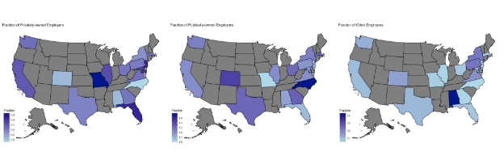
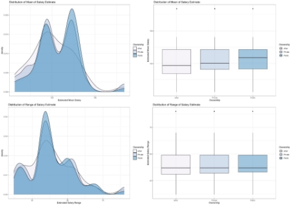
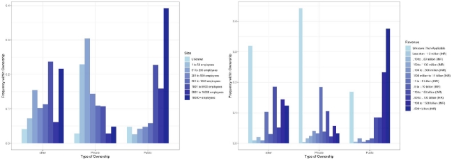
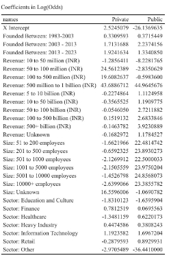
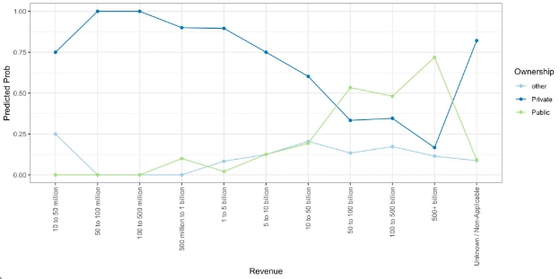
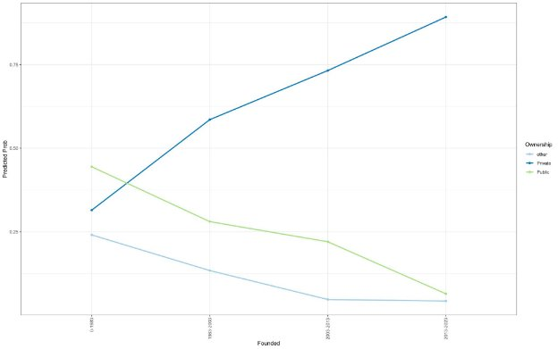

Final Project Report Daniel Lee and Jianing Ren Dec 12, 2022

1. **Introduction**
1. **Motivation**

As statistics majors fresh out of college, finding a suitable job in the field of statistics and data science from a reputable company is one of our top concerns. In our job search process, we found data-related jobs from a variety of companies: some are multinational publicly-traded industry leaders, while some are newly-founded startups that pioneer novel ideas and practices. This inspired us to examine what characteristics these firms share and what makes them unique. In this project, we are proposing using multinomial regression to predict firm ownership type based on job positions with “data” in the title. Company ownership falls into three main categories: privately owned, publicly traded, and others that cannot be easily categorized as either public or private, such as nonprofits, governmental organizations, or academic institutions.

2. **Dataset and Modelling Strategy**

The data was scraped from Glassdoor.com, the biggest job review and posting site, by Kaggle user Rekib Ahmed[^1]. The web-scraped profile for every job posting gives us the title, annual salary estimate (given in a range format), job description, company name, location of the job posting and the company’s headquarters (city and state), size (number of employees in range format), location of the corporate headquarters, rating (a 1-5 score that former or current employees give the company), revenue (Indian Rupees in a range format), and when the company was founded.

The dataset contains 825 jobs with 56% of the employers being privately owned, 28% being publicly traded, and 16% of companies falling in the other category, which is a rather suitable proportion for multinomial classification. The job titles are mainly concerned with data science, with 51% being the exact string “Data Science”. This does not account for the other titles that are an amalgamation of other modifiers combined with data science: i.e. “Principal Data Scientist”, “Junior Data Scientist”, or “Associate Data Scientist”. Because these modifiers imply different seniority and thus can potentially correlate with characteristics of the employer, we will attempt to extract them using text processing tools (such as Regular Expression) as an additional predictor.

Using this model, we attempt to study if any of these company characteristics can effectively distinguish between public, private, and other (government, NPO) ownerships. For example, do private companies tend to pay more after controlling for the seniority of the job applicant? Do public companies have lower ratings because they tend to attract more scrutiny from the public? Does California attract more public companies that employ data science specialists? Does Washington DC attract more government/NPOs? All of these are important questions for students in a senior statistics seminar looking for jobs in the age of Big Data, and can provide insight into the broader job market.

2. **Exploratory Data Analysis**
1. **Data Cleaning**

The majority of the ratings are concentrated from 3-5, with some null values denoted by -1 in this data set. We converted the -1’s to NA’s in R, before any exploratory data analysis or modeling. Further, 20 out of the 825 jobs record hourly salaries instead of annual salaries. We first tried annualizing these salaries, but this resulted in significantly lower annual salary estimates compared to the rest of the jobs (the annualized salaries are mostly around $40,000, whereas other jobs start at around $80,000). Upon closer examination, we found that these jobs are mostly internships and contractor jobs. As a result, we removed these 20 jobs from the sample because they belong to a fundamentally different population than full-time jobs, which we aim to study. In addition, if these hourly jobs are kept in the sample, these low outliers might lead to a pseudo-association between salary and ownership.

Another challenge is to extract the job’s seniority modifier. As explained earlier, having this additional piece of information in our model possibly increases its fit, and can possibly shed light on whether employers of different ownerships differ in terms of preferences on seniority. We manually reviewed all 805 jobs (excluding the 20 jobs with hourly wages), and found those modifiers to be “senior”, “sr”, “manager”, “director”, “vp”, “lead”, “principal”, or job titles with a roman numeral postscript greater than or equal to II: for example, “Data Analyst II”. We created a dummy variable, called Seniority, that indicates whether a job title contains one or more of these keywords.

Many other variables need to be transformed as well. Because the salary estimate is given as a range on Glassdoor.com (for example, “100K - 130K”), we converted it to two continuous variables, meanSalary and rangeSalary, by taking the mean and difference of the upper and lower estimates. In the example above, the meanSalary would be 115K, and the rangeSalary would be 30K. The company’s revenue is similarly given as a range; however, we found there are only 12 possible ranges, and each range is extremely broad (for example, “10 billion to 50 billion”). Consequently, we decided to keep the revenue variable as is, instead of converting it to the mean of each range group. Year Founded is kept as numeric (the original format) and as ordinal by cutting at its quartile points. The Sector variable originally contains more than 30 different industries, many of which contain only one or two firms. As a result, we combined the Sector variable into only 8 categories. The resulting categorization is shown below.

2. **EDA**

Figure 1 below shows the geographical distribution of the number of job postings on the top, and the distribution of proportion for each of the three types of ownership on the bottom. For the map on the top, we see that California has by far the greatest number (184) of job postings, accounting for 23% of all jobs in the dataset. A significant portion (66.3%) of these Californian jobs are from private employers. For the three maps on the bottom, we removed states with fewer than 10 job postings; otherwise, we will end up with 0%/100% frequency for a type of ownership in a state with very few job postings. We see that Missouri, North Carolina, and Alabama have the highest frequency for public, private, and other employers, respectively. However, because the number of jobs in these three states is not very high (15,20,11 jobs, respectively), geography might not be a statistically significant distinguisher for ownership.

Figure 1: geographical distribution of the number of job postings and frequency of ownership

Figure 2 below shows the conditional distribution of mean salary estimate and salary range on company ownership. The distribution is presented both as kernel density estimates (by using geom\_density() in the ggplot package) on the left and as boxplots on the right. From the density plots, it appears that public and private employers have very similar salary mean and range: the distribution of mean salaries is bimodal at 90K and 125K, and the range is unimodal at around 30K, although it appears that public companies have a higher mean salary peak at 125K. This is consistent with the boxplot on the top right, which shows that public companies have a higher median salary. Firms with other types of ownership, however, do not have a bimodal salary distribution, and the salary range is more evenly distributed with a less pronounced peak.

Figure 2: Conditional Distribution of Salary Mean & Range

Next, we look at some inherent properties of the companies that might differentiate ownership - namely their rating, size, and revenue. Figure 3 below shows the fraction of each size/revenue range within each type of ownership. As we might expect, publicly traded companies generally are the biggest and the most lucrative ones: nearly 40% of public companies have more than 10000 employees and earn more than 500 billion rupees per year, both are the top range within our dataset. On the other hand, private companies have the smallest fraction of these top ranges: only 5% of private companies have more than 10000 employees, and only 2.5% earn more than 500 billion rupees per year. The other category is in the middle between private and public companies in terms of size and revenue.

Figure 3: Conditional Distribution of Company Size and Revenue

Finally, let’s take a look at the seniority variable. Figure 4 below shows the distribution of the proportion of job titles that imply seniority (for example, “Senior Data Analyst”) and the distribution of mean salary estimates, conditional on company ownership. It appears that public companies post a slightly higher proportion of senior jobs on Glassdoor.com; however, its significance in multinomial modeling is suspect. Strangely, it appears that senior jobs even have lower median wages than standard jobs, although senior jobs have much higher upper salary whiskers in private and public companies.

Figure 4: Conditional Distribution of Proportion of Senior Jobs and their Mean Salary

3. **Methods**

Due to the three-category nature of our response variable, the most sensible choice for modeling was a multinomial regression. When analyzing what variables to incorporate into the full model, we chose rating (continuous), seniority (binary), mean and range of salary (continuous), revenue (categorical), size of the company (categorical), job posting state (categorical), company headquarter state (categorical), and year founded. Initially, we looked at the year founded as a continuous variable, but due to the clustering of years in certain very concise ranges we decided to discretize it based on the quartile points. When year founded is included as a continuous variable it is still statistically significant; however the interpretation of the coefficients is very difficult because they are close to .001. As mentioned in section 2.1, we also collapsed the number of sectors because there were sectors that only had one entry in them and were very niche fields. After collapsing and converting the variables to make them easier to understand and interpret, we ran a forward model selection to identify the most significant predictors. We initially ran a BIC selection because our model had numerous covariates and the added penalization of BIC seemed warranted. The BIC selection reduced our model significantly; as a crosscheck, we also ran an AIC selection. Both selection processes arrive at the same model:

Where the log odds of the coefficients of private and public are in relation to “other” ownership (the baseline category). When all the subcategories of founded, revenue, size, and sector are added up there are a total of 27 coefficients!

4. **Results**

The model output in log(odds) is:

Figure 5. A table of the AIC/BIC selected model

The x-intercept of predicting public companies is significantly negative to account for the high density of companies with ownership type of other to have an unknown size. Public companies tend to have a reported size concentrated among the upper end of the spectrum, while private companies tend to have a reported size of unknown. The high proportion of public companies in the larger size categories cause the coefficients to be much larger than private companies. The largest outlier in the coefficients is the revenue category from 500 million to 1 billion (INR) where both private and public have a log of odds of greater than 40. The explanation for this extreme coefficient is that there are no companies with an “other” ownership that have a revenue of 500 million to 1 billion (INR). Another extreme coefficient occurs in the public companies in the sector that falls into the other category, which is because there are no public companies in the other sector.

5. **Interpretation and Conclusion**

These coefficients, while difficult to interpret mathematically, give a picture about what characteristics a company has. These results are consistent with our EDA in section 2.2 and with our intuition, as larger (in size and revenue) companies tend to be public, followed by other and private. Looking at the Revenue variable in figure 5 above, we see the log odds of public companies increase more than three-fold (1.11 to 3.92) as we move from the smallest to the largest revenue category. This indicates that high revenue is a particularly strong signal that a company is public as opposed to other. On the contrary, the same set of coefficients are negative for the log odds of private companies, which indicates that higher revenue is evidence *against* a company being private, even compared to other. The exact same pattern holds for the Size variable, although the coefficients differ in magnitude. Although we aren’t able to directly compare the log odds of public against private, the above test statistically justifies a significant relationship between company revenue and ownership.

Compared to the baseline sector of business services, public companies tend to be well distributed in established sectors such as information technology, retail, and healthcare, while private companies are concentrated more highly in certain sectors like finance or information technology. It is also worth noting that both private and public companies have a negative coefficient on the education and culture sector, implying that these sectors tend to have high concentrations of the “other” ownership type. This finding aligns with our intuition that the other type of ownership tends to be government or academic-related institutions. Another expected trend is that private companies tend to be founded closer to the present, but public companies are scattered throughout our time range. This suggests that public companies need more years to financially establish themselves before going public, while also corroborating our own job-search experience that a lot of data-related jobs are from startups, which are recently founded private companies.

6. **Limitations**

There are some biases we are picking up in regard to this dataset. Certain companies have more Glassdoor data jobs, which biases the results towards companies that have more postings. Another bias is that many of the private and “other” companies have unknown or not applicable entries, which harms the regression because in every one of our categories these unknown values are statistically significant. With all the covariates being categorical variables, we have to wonder if this data set is better suited for modeling with a decision tree. Regardless of the biases in modeling and data, we can glean insight into what characteristics companies possess and what that means for us as new graduates. Disappointingly, all the significant features in our multinomial model are relating to the inherent features of the company, as opposed to evidence from its job postings. Specifically, none of the Glassdoor-related variables (Seniority, Salary, Rating) are significant. If we utilized NLP, then we could exploit the job descriptions covariate (which we ignored for this model) and analyze whether companies with different ownerships differ in terms of the wording of the job description; however, as of now, we can all but say that the job-related variables fail to significantly distinguish between companies’ ownerships. Additionally, because many of our variables, which are continuous in reality, are recorded as categorical or range variables in the dataset, our model lacks the precision that it otherwise would have had.

Figure 6: A scatter plot showing how revenue affects the probability that a company is public

Figure 7: The probability that a company is private increases as we get closer to the present, while the probability a company is public decreases

Figure 8: The probability that a company is private decreases as the size of the company increases, while the probability a company is public or other increases as the company size gets larger

[^1]: Source: <https://www.kaggle.com/datasets/rkb0023/glassdoor-data-science-jobs>
